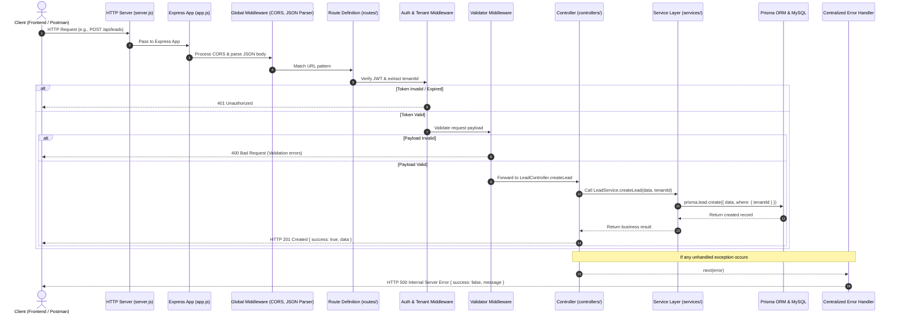

# CRM nErgy — System Architecture

## 🏛️ Architectural Overview

The CRM nErgy backend follows a modular, layered architecture adhering to the **Separation of Concerns (SoC)** principle. The application separates transport handling (HTTP/Express) from business logic (Services) and database persistence (Prisma ORM).

---

## 📂 Directory Structure & Responsibilities

```text
backend/
├── prisma/
│   └── schema.prisma         # Declarative data models and datasource definition
├── src/
│   ├── config/               # Environment variables, database clients, constants
│   ├── controllers/          # HTTP request parsing, status codes, response mapping
│   ├── middleware/           # Authentication, RBAC, input validation, error handling
│   ├── routes/               # URL routing definitions and endpoint mappings
│   ├── services/             # Core business logic and database operations
│   ├── validators/           # Request body, query, and param validation schemas
│   ├── utils/                # Reusable helper functions, formatters, and loggers
│   ├── app.js                # Express app instance and global middleware configuration
│   └── server.js             # HTTP server creation, port binding, and lifecycle events
└── docs/                     # Technical specifications and operational documentation
```

### Detailed Component Responsibilities

| Directory / File | Responsibility |
| :--- | :--- |
| **`prisma/`** | Contains `schema.prisma` defining relational models, field types, indexes, and relations between entities. Serves as single source of truth for database schema. |
| **`src/config/`** | Centralizes configuration objects (e.g. database client singleton, JWT options, environment constant mappings). Prevents scattered `process.env` calls. |
| **`src/controllers/`** | Handles incoming HTTP requests: extracts parameters, invokes appropriate service methods, and formats standardized HTTP responses (`200`, `201`, `400`, `404`). Never executes database queries directly. |
| **`src/middleware/`** | Intercepts requests before reaching controllers. Responsibilities include authentication token verification, tenant extraction, role permission checks, and centralized error catching. |
| **`src/routes/`** | Defines API endpoint paths (e.g. `/api/leads`, `/api/deals`) and connects routes to validation schemas, auth guards, and controller actions. |
| **`src/services/`** | Houses pure business logic, calculations, workflow transitions, and interacts directly with `@prisma/client` to query and persist data. |
| **`src/validators/`** | Defines validation schemas (e.g. validating email format, required fields, enum boundaries) ensuring invalid data is rejected before hitting controllers. |
| **`src/utils/`** | Contains stateless utility functions such as response formatters, date helpers, pagination utilities, and hashing helpers. |
| **`src/app.js`** | Factory function/instance for the Express application. Configures CORS, JSON body parsers, URL-encoded parsers, top-level route mounts, and global error handlers. |
| **`src/server.js`** | Application entry point. Loads environment variables, imports `app.js`, binds to `PORT`, listens for connections, and handles process lifecycle events (`SIGTERM`, `EADDRINUSE`). |

---

## 🔄 End-to-End Request Lifecycle



---

## 📐 Design Principles

1. **Thin Controllers, Rich Services**: Controllers focus solely on HTTP communication (status codes, headers, response format). Services own domain rules, business validations, and data persistence.
2. **Multi-Tenant Context Propagation**: The tenant identifier (`tenantId`) is resolved at the middleware layer and passed explicitly through to service queries to prevent cross-tenant data leakage.
3. **Stateless Scalability**: No session state is held in server memory. User identity and permissions are verified via cryptographic JWTs, allowing horizontal server scaling.
4. **Predictable Error Handling**: Any exception thrown in asynchronous handlers is forwarded to `next(err)` and transformed into a structured, sanitized JSON error response.
