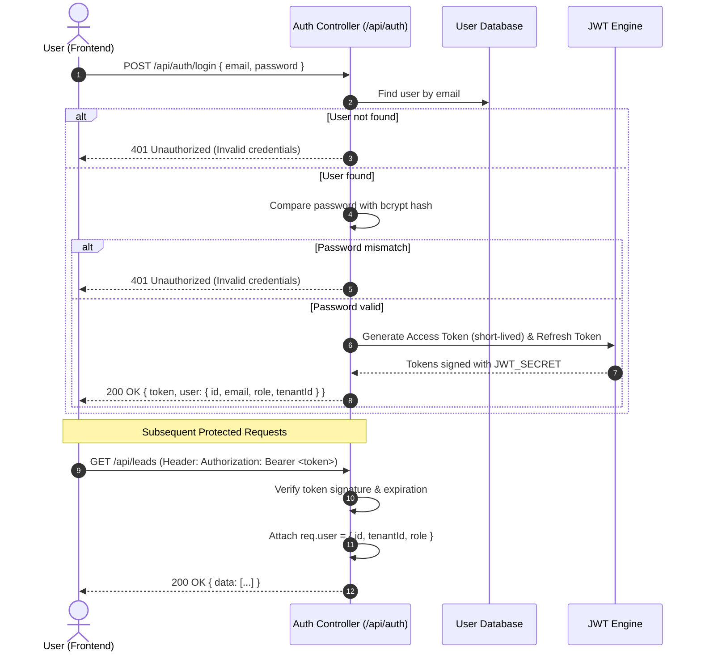

# CRM nErgy — Authentication Architecture

## 📌 Implementation Status

- **Status**: ⏳ **PLANNED / NOT IMPLEMENTED**
- **Target Phase**: Step 5 (Authentication & RBAC)

---

## 🔒 Authentication Strategy

CRM nErgy uses **JSON Web Token (JWT)** stateless bearer authentication. The architecture decouples session storage from backend servers, allowing horizontal scaling and cross-service verification.



---

## 🔑 Key Components

### 1. Password Security
- Passwords are never stored in plaintext.
- Planned algorithm: `bcryptjs` with a work factor / salt rounds of `12`.
- Secure password validation rules (minimum 8 characters, numbers, and symbols).

### 2. Token Lifecycle
- **Access Token**:
  - Payload: `{ userId, tenantId, role, email }`
  - Signed using: `JWT_SECRET` (from `.env`)
  - Expiration: `15m` to `1h` (or configurable via `JWT_EXPIRES_IN`)
- **Refresh Token**:
  - Stored in a secure HTTP-only cookie or encrypted token store.
  - Expiration: `7d` to `30d`.
  - Used to obtain a fresh access token without requiring re-login.

### 3. Protected Route Middleware
A planned Express middleware `authenticateToken.js` will intercept incoming requests:
```javascript
// Planned Implementation Blueprint
const jwt = require('jsonwebtoken');

const authenticateToken = (req, res, next) => {
  const authHeader = req.headers['authorization'];
  const token = authHeader && authHeader.split(' ')[1];

  if (!token) {
    return res.status(401).json({ success: false, message: 'Access token required' });
  }

  jwt.verify(token, process.env.JWT_SECRET, (err, user) => {
    if (err) {
      return res.status(403).json({ success: false, message: 'Invalid or expired token' });
    }
    req.user = user;
    req.tenantId = user.tenantId;
    next();
  });
};
```
