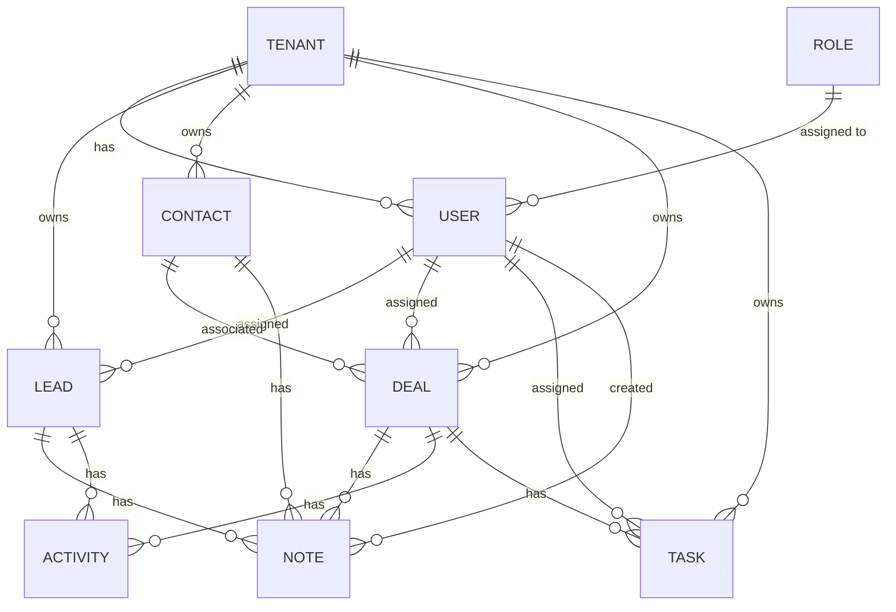

# CRM nErgy — Database & Persistence Layer

## 🗄️ Database Technology & Engine

- **Database Engine**: MySQL/MariaDB via XAMPP
- **Host**: `localhost` (or `127.0.0.1`)
- **Port**: `3306`
- **Database Name**: `crm-db`
- **ORM / Query Builder**: Prisma ORM `^6.4.1`
- **Client Library**: `@prisma/client` `^6.4.1`
- **Generator Provider**: `prisma-client-js`
- **Datasource Provider**: `mysql`

---

## 📌 Local Development Environment Status

| Property | Status | Notes |
| :--- | :--- | :--- |
| **MySQL Server** | **LOCAL DEVELOPMENT** | Active via XAMPP (`localhost:3306`) |
| **Database** | `crm-db` | Active multi-tenant database |
| **Connection Status** | **DATABASE CONNECTED** | Prisma successfully connects to `crm-db` on port 3306 |
| **Prisma CRM Models** | **DEFINED & GENERATED** | 8 multi-tenant models & 6 enums defined; `@prisma/client` generated |
| **Database Tables** | **8 TABLES + MIGRATIONS** | 8 relational tables + `_prisma_migrations` created |
| **Migration** | **APPLIED (`init_crm_schema`)** | Initial migration applied via `prisma migrate dev` |

---

## 📌 Verified Schema Models & Enums

### Implemented Models
1. **`Tenant`**: Multi-tenant company root (`tenants` table)
2. **`User`**: Team members, authentication, and role assignments (`users` table)
3. **`Lead`**: Sales leads with scoring, status, and conversion tracking (`leads` table)
4. **`Contact`**: Customer address book and business accounts (`contacts` table)
5. **`Deal`**: Pipeline opportunities with stage, valuation, and probabilities (`deals` table)
6. **`Task`**: Scheduled activities, reminders, priorities, and assignments (`tasks` table)
7. **`Note`**: Contextual notes attached to Leads, Contacts, or Deals (`notes` table)
8. **`Activity`**: Audit stream logging calls, emails, status changes, and meetings (`activities` table)

### Implemented Enums
- **`Role`**: 12 verified business personas (`BUSINESS_OWNER`, `CUSTOMER`, `CONTENT_CREATOR`, `CONTENT_BUILDER`, `INFLUENCER`, `AFFILIATE_PARTNER`, `AI_MARKETING_PRO`, `HR`, `OPERATIONS_SALES_ADMIN`, `FINANCE_COMPLIANCE_ADMIN`, `CRM_PRO`, `SUPER_ADMIN`)
- **`DealStage`**: 8 pipeline stages (`NEW_LEAD`, `CONTACTED`, `QUALIFIED`, `OPPORTUNITY`, `PROPOSAL`, `NEGOTIATION`, `WON`, `LOST`)
- **`LeadStatus`**: `NEW`, `CONTACTED`, `QUALIFIED`, `PROPOSAL`, `WON`, `LOST`
- **`Priority`**: `LOW`, `MEDIUM`, `HIGH`, `URGENT`
- **`TaskStatus`**: `PENDING`, `IN_PROGRESS`, `COMPLETED`, `CANCELLED`
- **`ActivityType`**: `NOTE_ADDED`, `CALL_LOGGED`, `EMAIL_SENT`, `MEETING_HELD`, `STAGE_CHANGED`, `STATUS_CHANGED`, `LEAD_CONVERTED`, `TASK_CREATED`, `TASK_COMPLETED`

---

## 🏗️ Planned Relational Models (Step 3)

The following entities are planned for the CRM database:



### Entity Specifications

1. **`Tenant` (Company)**:
   - Primary key (`id`), name, domain, subscription status, timestamps (`createdAt`, `updatedAt`).
2. **`User`**:
   - Primary key (`id`), `tenantId`, `roleId`, email, passwordHash, firstName, lastName, phone, isActive, timestamps.
3. **`Role`**:
   - Primary key (`id`), name (`SUPER_ADMIN`, `TENANT_ADMIN`, `MANAGER`, `SALES_REP`), permissions JSON or relation.
4. **`Lead`**:
   - Primary key (`id`), `tenantId`, `assignedUserId`, name, email, phone, company, status (`NEW`, `CONTACTED`, `QUALIFIED`, `LOST`), source, value.
5. **`Contact`**:
   - Primary key (`id`), `tenantId`, firstName, lastName, email, phone, company, jobTitle, address.
6. **`Deal`**:
   - Primary key (`id`), `tenantId`, `contactId`, `assignedUserId`, title, value, stage (`DISCOVERY`, `PROPOSAL`, `NEGOTIATION`, `WON`, `LOST`), closeDate.
7. **`Task`**:
   - Primary key (`id`), `tenantId`, `assignedUserId`, title, description, dueDate, priority (`LOW`, `MEDIUM`, `HIGH`, `URGENT`), status (`PENDING`, `COMPLETED`).
8. **`Note`**:
   - Primary key (`id`), `tenantId`, `authorId`, content, targetType (`LEAD`, `CONTACT`, `DEAL`), targetId.
9. **`Activity`**:
   - Primary key (`id`), `tenantId`, `userId`, type (`CALL`, `MEETING`, `EMAIL`, `STATUS_CHANGE`), details, timestamp.

---

## 🏢 Multi-Tenant Data Isolation Strategy

All tenant-specific tables must enforce the following design rules:
1. **Mandatory `tenantId` Column**: Every business table (`Lead`, `Contact`, `Deal`, `Task`, `Note`, `Activity`) must include a foreign key `tenantId` referencing `Tenant(id)`.
2. **Compound Indexing**: Every table must index `tenantId` with its primary search and sort keys:
   ```prisma
   @@index([tenantId, createdAt])
   @@index([tenantId, status])
   ```
3. **Query Filtering**: All Prisma queries must include `where: { tenantId }` to ensure zero cross-tenant data leakage.

---

## 🛡️ Migration Policy & Rules

1. **Zero Destructive Operations**:
   - Never execute `npx prisma migrate reset` in any shared or production environment.
   - Never execute `npx prisma db push --force-reset`.
2. **Version-Controlled Code-First Migrations**:
   - All schema changes must be generated via:
     ```bash
     npx prisma migrate dev --name <descriptive_migration_name>
     ```
   - Generated SQL files in `prisma/migrations/` must be committed to Git.
3. **Production Deployment**:
   - In production environments, apply migrations strictly using:
     ```bash
     npx prisma migrate deploy
     ```
