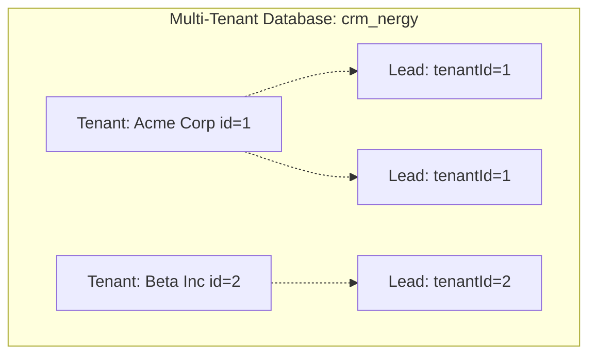

# CRM nErgy — Multi-Tenancy Architecture

## 📌 Implementation Status

- **Status**: ⏳ **PLANNED / NOT IMPLEMENTED**
- **Target Phase**: Step 3 (Database Schema) & Step 5 (Middleware Integration)

---

## 🏢 Multi-Tenant Strategy

CRM nErgy employs a **Shared Database, Shared Schema with Discriminator Column** multi-tenancy model. 

### Why Shared Schema with Discriminator?
1. **Operational Simplicity**: Single database and single migration pipeline across all customer organizations.
2. **Cost & Resource Efficiency**: Low operational overhead compared to database-per-tenant or schema-per-tenant architectures.
3. **Seamless Provisioning**: New tenant companies are onboarded instantly with a single database insert rather than executing heavy DDL commands.



---

## 🔒 Tenant Isolation Mechanisms

To guarantee that Tenant A can never view or manipulate data belonging to Tenant B, three defensive layers are enforced:

### 1. Request Identification Layer
- Each incoming request is authenticated via JWT.
- The `tenantId` is extracted directly from the verified cryptographic token payload.
- Alternatively, for subdomains or custom domains (e.g. `acme.crmnergy.com`), a tenant resolution middleware identifies the organization from the `Host` or `X-Tenant-ID` header.

### 2. Context Injection Middleware
```javascript
// Planned Implementation Blueprint
const tenantContext = (req, res, next) => {
  if (req.user && req.user.tenantId) {
    req.tenantId = req.user.tenantId;
    return next();
  }
  return res.status(400).json({ success: false, message: 'Tenant context missing' });
};
```

### 3. Service & Query Level Scoping
All Prisma database interactions in services strictly inject the `tenantId` into queries:
```javascript
// Example Service Query Scoping
const getLeads = async (tenantId, queryParams) => {
  return await prisma.lead.findMany({
    where: {
      tenantId: tenantId, // Strict tenant barrier
      ...queryParams,
    },
  });
};
```

---

## 🚀 Tenant Onboarding Workflow

1. User registers new organization via `POST /api/auth/register-company`.
2. A new `Tenant` record is created in the database.
3. The initial user account is created with `role: TENANT_ADMIN` linked to the new `tenantId`.
4. Default pipeline stages and configuration settings are seeded for the new organization.
