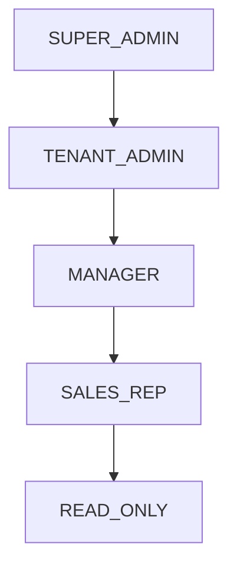

# CRM nErgy — Role-Based Access Control (RBAC)

## 📌 Implementation Status

- **Status**: ⏳ **PLANNED / NOT IMPLEMENTED**
- **Target Phase**: Step 5 (Authentication & RBAC)

---

## 👥 Standard Role Hierarchy

CRM nErgy defines hierarchical user roles with increasing privilege levels:



| Role | Scope | Description |
| :--- | :--- | :--- |
| **`SUPER_ADMIN`** | Platform-Wide | System administrator with full access to all tenants, billing, and platform settings. |
| **`TENANT_ADMIN`** | Tenant-Wide | Company administrator managing organizational users, roles, pipelines, and integrations. |
| **`MANAGER`** | Department / Team | Sales or team manager with access to all team leads, deals, reports, and assignments. |
| **`SALES_REP`** | Individual / Assigned | Sales executive with full control over assigned leads, contacts, deals, and activities. |
| **`READ_ONLY`** | Viewer | Stakeholder or auditor with read-only visibility into tenant CRM data. |

---

## 🛡️ Permissions Matrix

Permissions follow the standard `resource:action` naming convention:

| Permission | SUPER_ADMIN | TENANT_ADMIN | MANAGER | SALES_REP | READ_ONLY |
| :--- | :---: | :---: | :---: | :---: | :---: |
| `tenants:manage` | ✅ | ❌ | ❌ | ❌ | ❌ |
| `users:create` | ✅ | ✅ | ❌ | ❌ | ❌ |
| `users:read` | ✅ | ✅ | ✅ | ❌ | ❌ |
| `leads:create` | ✅ | ✅ | ✅ | ✅ | ❌ |
| `leads:read:all` | ✅ | ✅ | ✅ | ❌ | ✅ |
| `leads:read:assigned` | ✅ | ✅ | ✅ | ✅ | ✅ |
| `leads:update` | ✅ | ✅ | ✅ | ✅ (Own) | ❌ |
| `leads:delete` | ✅ | ✅ | ✅ | ❌ | ❌ |
| `deals:manage` | ✅ | ✅ | ✅ | ✅ (Own) | ❌ |
| `reports:export` | ✅ | ✅ | ✅ | ❌ | ❌ |

---

## 🚦 Planned Authorization Middleware

### 1. Role-Based Guard (`authorizeRoles`)
Restricts endpoints to specific high-level roles:
```javascript
// Planned Implementation Blueprint
const authorizeRoles = (...allowedRoles) => {
  return (req, res, next) => {
    if (!req.user || !allowedRoles.includes(req.user.role)) {
      return res.status(403).json({
        success: false,
        message: 'Forbidden: Insufficient role permissions',
      });
    }
    next();
  };
};

// Usage Example:
// router.delete('/api/users/:id', authenticateToken, authorizeRoles('SUPER_ADMIN', 'TENANT_ADMIN'), UserController.deleteUser);
```

### 2. Permission-Based Guard (`authorizePermission`)
Evaluates granular permission claims:
```javascript
// Planned Implementation Blueprint
const authorizePermission = (requiredPermission) => {
  return (req, res, next) => {
    const userPermissions = req.user.permissions || [];
    if (!userPermissions.includes(requiredPermission)) {
      return res.status(403).json({
        success: false,
        message: `Forbidden: Missing required permission: ${requiredPermission}`,
      });
    }
    next();
  };
};
```
