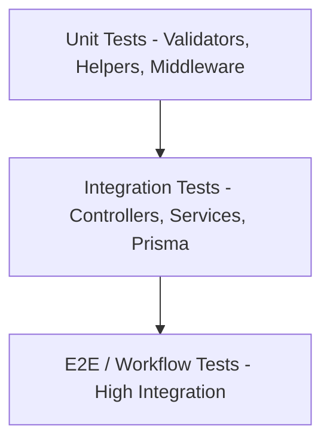

# CRM nErgy — Testing Strategy & Guidelines

## 📌 Implementation Status

- **Status**: ⏳ **PLANNED / NOT IMPLEMENTED**
- **Target Phase**: Step 6 & Continuous Integration Setup

---

## 🎯 Testing Philosophy

The CRM nErgy backend testing pyramid emphasizes high-confidence integration tests around API endpoints and business services, complemented by fast unit tests for utility functions.



---

## 🧪 Testing Pyramid & Levels

### 1. Unit Tests
- **Focus**: Pure functions, mathematical calculations, utility formatters, and isolated validator rules.
- **Dependencies**: No external network or database calls. All I/O is mocked.
- **Speed**: Executes in milliseconds.

### 2. Integration Tests (API Endpoint Level)
- **Focus**: Testing routes, middleware pipelines, controller status codes, and service database operations.
- **Tooling**:
  - Test Runner: **Jest** or **Vitest**
  - HTTP Assertion: **Supertest**
  - Database Client: Prisma connected to a dedicated test database (`crm_nergy_test`).
- **Isolation Strategy**: Each test suite runs within an isolated database transaction that rolls back after test execution, or tables are truncated between suites.

### 3. End-to-End (E2E) Scenario Tests
- **Focus**: Complete business flows (e.g. User Registration -> Create Lead -> Move to Qualified -> Convert to Deal -> Close Won).

---

## 📋 Planned Testing Workflow

### Recommended Setup Script
```bash
npm install -D jest supertest dotenv-cli
```

### Planned `package.json` Test Scripts
```json
"scripts": {
  "test": "dotenv -e .env.test -- jest --runInBand",
  "test:watch": "dotenv -e .env.test -- jest --watch",
  "test:coverage": "dotenv -e .env.test -- jest --coverage"
}
```

### Example Test Suite Blueprint
```javascript
const request = require('supertest');
const app = require('../src/app');

describe('GET /api/health', () => {
  it('should return 200 OK with success message', async () => {
    const res = await request(app).get('/api/health');
    expect(res.statusCode).toEqual(200);
    expect(res.body.success).toBe(true);
    expect(res.body.message).toBe('CRM nErgy API is running');
  });

  it('should return 404 for unknown endpoints', async () => {
    const res = await request(app).get('/api/non-existent-route');
    expect(res.statusCode).toEqual(404);
    expect(res.body.success).toBe(false);
  });
});
```
